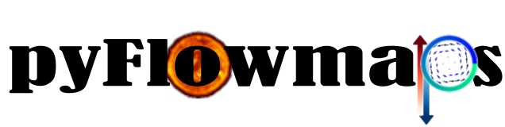
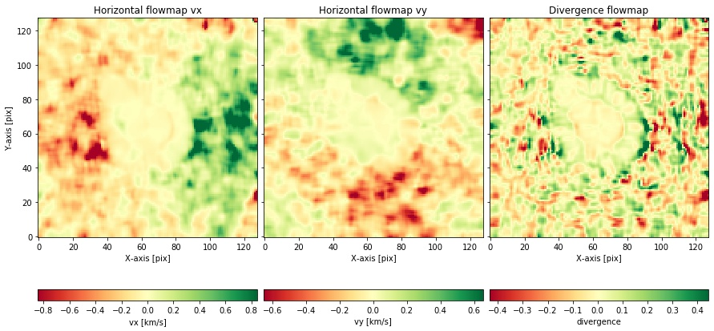
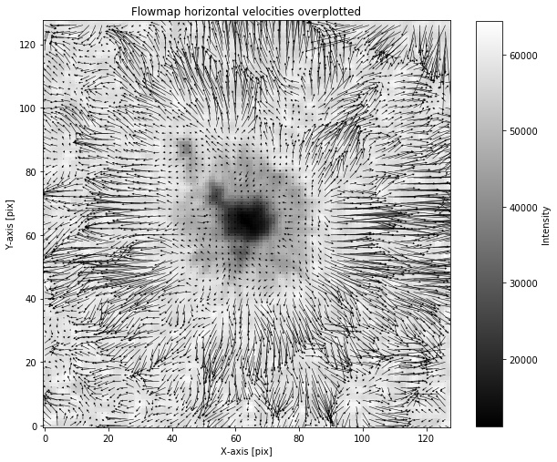

[](https://github.com/Hypnus1803/pyflowmaps/actions/workflows/ci.yml)

Package to infer horizontal velocities and divergence fields from intensity filtergrams, as well as magnetograms taken from the Sun.

**pyflowmaps** is a Python package providing three algorithms: *LCT (Local Correlation Tracking)*, *ILCT (Induction Local Correlation Tracking)*, and *DAVE4VM*.

LCT was proposed for the first time by [November and Simon (1988)](https://ui.adsabs.harvard.edu/abs/1988ApJ...333..427N/abstract), and it has been used widely in solar physics for the calculation of proper motions on the solar surface from consecutive frames in a time series of intensity maps.

ILCT was proposed by [Welsch, B. T., et al. (2004)](https://ui.adsabs.harvard.edu/abs/2004ApJ...610.1148W/abstract). It combines LCT/FLCT (Fourier Local Correlation Tracking; [Fisher & Welsch (2008)](https://ui.adsabs.harvard.edu/abs/2008ASPC..383..373F/abstract)) with the induction equation to obtain the velocity flow field in magnetized regions on the solar surface.

DAVE4VM was proposed by [P. W. Schuck (2008)](https://ui.adsabs.harvard.edu/abs/2008ApJ...683.1134S/abstract). This implementation adapts the Python version by [A. Chicrala](https://github.com/Chicrala/pydave4vm) and integrates it with the other velocity estimators.

These three algorithms are based on IDL scripts, but they have changed through time since we started the project.

### Requirements
- [Numpy](https://numpy.org/)
- [Scipy](https://www.scipy.org/)
- [Astropy](https://docs.astropy.org/en/stable/)
- [SunPy](https://sunpy.org/) (optional; used for pixel scale handling if available)
- Python >= 3.7

### Installation
Download the package from the github repository of [pyFlowmaps](https://github.com/Hypnus1803/pyflowmaps) using
```bash
git clone https://github.com/Hypnus1803/pyflowmaps
```
or download the zip file with the package. Then go into the folder and install it, with the necesssary dependencies.
```bash
$ cd pyflowmaps
$ pip install .
# For development installs:
$ pip install -e .
# With optional SunPy support:
$ pip install .[sunpy]
```
### How to use it:
Firstly, we encourage the users to have the data in the final stage of processing data, in the form of a data-cube, that means in the form (nt,ny,nx), where *nt* is the time dimension, or number of images, *ny* is the y-axis dimension, and *nx* is the x-axis dimension of our dataset. 

The processing steps include:
- Co-alignment of the region of interest (ROI): obtain robust proper motions of features in the ROI.
- p-mode (5-minute oscillation) filtering: those oscillations can add errors or artifacts to the flowmaps.
- Data shape: the data must be a cube with shape (nt, ny, nx).
If the data is ready, you can go to a python or ipython terminal and try to run it. We will show you the basic command line with the purpose of explain parameters, but if you want a better example, you can find some test data, and a [jupyter](https://jupyter.org/) notebook in the folder *test/*.
```python
from pyflowmaps.flow import flowLCT
velocity_field = flowLCT(cube,fwhm_arcsec=3, scale=0.504, cadence=720)
```
where `cube` is the dataset, `fwhm_arcsec` is the apodization window in arcsec, `scale` is the pixel size of the image (for SDO/HMI ~0.504 arcsec/pixel), and `cadence` is the time interval between consecutive images (seconds). The output is a namedtuple structure, and the user can access the velocity fields as follows:
```python
vx = velocity_field.vx
vy = velocity_field.vy
vz = velocity_field.vz
```
where $$v_x$$ and $$v_y$$ are the flow fields in the x and y directions respectively, with shape *(ny, nx)* and units of *km/s*. $$v_z$$ array is the vertical field given by $$v_z = h_m\nabla\cdot v_h(v_x,v_y)$$, where $$v_h$$ are the horizontal velocities that depend on $$v_x$$ and $$v_y$$, and $$h_m=150$$ km is the mass-flux scale height [(November 1989, ApJ, 344, 494)](https://ui.adsabs.harvard.edu/abs/1989ApJ...344..494N/abstract). Some authors prefer to show the divergence instead of $$v_z$$, in which case divide by $$h_m$$.

When we plot the outputs of the velocity field, we get the flowfields,



and then, we can plot the arrows over the context image from the cube data,


