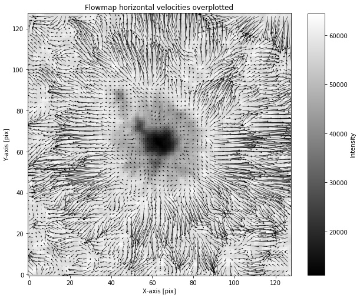

Package to infer horizontal velocities, and divergence fields from intensity filtergrams,as well as magnetograms taken from the Sun.

**pyFlowmaps** is a python package developed using two algorithms named *LCT (Local Correlation Tracking)* and *ILCT (Induction Local Correlation Tracking)*.

LCT was proposed for the first time by [November and Simon (1988)](https://ui.adsabs.harvard.edu/abs/1988ApJ...333..427N/abstract), and it has been used widely in solar physicis for the calculation of proper motions on solar surface of consecutive frames in a time series of intensity maps.

ILCT was proposed firstly by [Welsch, B. T., et al. (2004)](https://ui.adsabs.harvard.edu/abs/2004ApJ...610.1148W/abstract), and it is a combination algorithm between LCT, but including induction equation to obtain the velocity flow field in magnetized regions on the solar surface.

These two algorithms are based on IDL scripts, but they have changed through time since we started the project.

### Requeriments:
- [Numpy](https://numpy.org/)
- [Scipy](https://www.scipy.org/)
- [Astropy](https://docs.astropy.org/en/stable/)
- [Sunpy](https://sunpy.org/)

### Instalation:
Download the package from the github repository of [pyFlowmaps](https://github.com/Hypnus1803/pyflowmaps) using
```bash
git clone https://github.com/Hypnus1803/pyflowmaps
```
or download the zip file with the package. Then go into the folder and install it, with the necesssary dependencies.
```bash
$ cd pyflowmaps
$ python setup.py bdist_wheel
$ pip install -e .
```
### How to use it:
Firstly, we encourage the users to have the data in the final stage of processing data, in the form of a data-cube, that means in the form (nt,ny,nx), where *nt* is the time dimension, or number of images, *ny* is the y-axis dimension, and *nx* is the x-axis dimension of our dataset. 

The processing data steps include:
- Co-aligment of the region of interest (ROI): To obtain the best proper motions of the features in the ROI.
- p-modes (5-min oscillation) filtering: Those oscillations could add errors or artifact to the flowmaps.
- Data shape: As it was mentioned, the data must be a cube, with the correct shape (nt,ny,nx).
If the data is ready, you can go to a python or ipython terminal and try to run it. We will show you the basic command line with the purpose of explain parameters, but if you want a better example, you can find some test data, and a [jupyter](https://jupyter.org/) notebook in the folder *test/*.
```python
from pyflowmaps.flow import flowLCT
velocity_field = flowLCT(cube,fwhm_arcsec=3, scale=0.504, cadence=720)
```
where cube is our dataset, *fwhm_arcsec* is the apodization window in arcsec units, *scale* is the pixel size of the image (for SDO/HMI is roughly 0.504 arcsec/pixel), and *cadence* is the time interval between two consecutive images. The output is a namedtuple structure, and the user can acces to the velocity fields as follows,
```python
vx = velocity_field.vx
vy = velocity_field.vy
vz = velocity_field.vz
```
where  and  are flow-field in the x, and y direction repectively, with shape *(ny,nx)*, and in *km/s* units, whereas the  array is the vertical field given by , where  are the horizontal velocities which depends on  and , whereas  is the mass-flux scale-heigth [(November 1989, ApJ,344,494)](https://ui.adsabs.harvard.edu/abs/1989ApJ...344..494N/abstract). Some authors prefer to show the divergences instead of the , so the user just need to divide .

When we plot the outputs of the velocity field, we get the flowfields,


and then, we can plot the arrows over the context image from the cube data,


